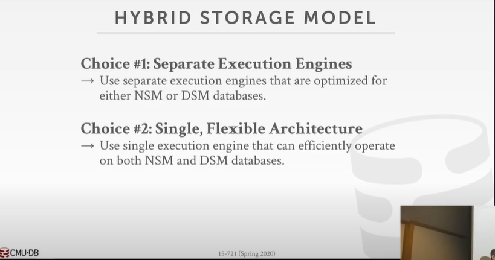
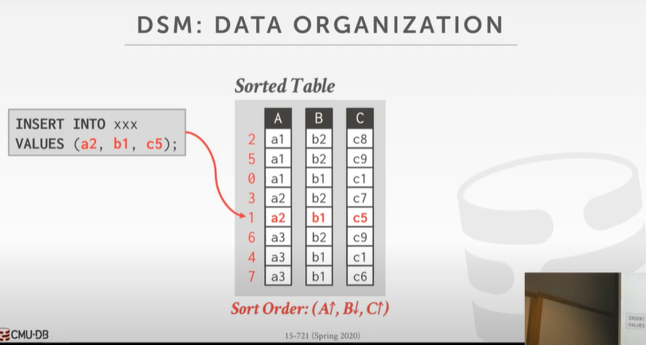
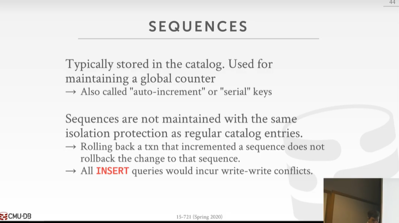

# 08-Database Storage Models & Layout (CMU databases/Spring 2020)

# 一 Data Layout

**数据库本质上就是一个byte array or char array**

一个数据库的表的表示如图所示，这个表中有一个主键（32-bit INT）和一个value （BIGINT/64-bit INT）：

header存储了地址指示我们要去哪里找table，**所有的header都是同样的位长**，所以数据库会知道如何跳过header，然后后面的32 bit会被解释为id，再后面的64 bit会被解释为value。

## 1 Variable-Length Fields

现在我们要存储一条变长的数据，那么该条insert指令会有64 bit的指针，指向这个数据的开头，LENGTH存储了一个固定长度的指针指向数据，NEXT指向数据的剩余部分的指针。

**所以如果我们的数据overflow了，无法用一个array存储，我们就要用这种形式把所有的数据connect起来。**

## 2 NULL Data Types

第三种方法显然不好，因为这样需要额外的空间开销，而且绝对不是用一个bit就行了，针对不同类型的数据，为了能够让数据对齐，我们需要增添不同bit位的空间开销。

如果选择第三种方式，那么各个类型的Null的Size会变成如下图所示：

## 3 Word-alignment

### 3.1 eg 

### 3.2 没有实现Word-Aligned的问题

- 第一个问题会造成数据读取的缓慢
- 第二个问题是可能读到一些我们不期望的组合
- 第三个问题可能是拒绝访问

### 3.3 Solutions★

①PADDING

②REORDERING，给数据重新排序，让他们组成64 bit的对齐，但仍有可能使用Padding

### 3.4 实验结果

# 二 Storage Models

## 1 Three types of storage

### 1 N-ary Storage Model(NSM)

一个tuple（一条数据）的所有attributes都被连续的存储在一起。

- 对增删改查方便
- 对取表或属性集的一部分不方便

### 2 Decomposition Storage Model(DSM)

所有数据的同一属性分别连续地存储在一起

- 减少了查询一部分数据时不必要的工作
- 更好的压缩
- 但是由于属性需要分裂，减慢了增删改查

### 3 Hybrid Storage Model

基于日常工程中的==Observation==，我们要对"hot data"和“cold data"采取不一样的存储方式。

#### 3.1 Fractured Mirrors

所有的更新先进入NSM，然后再DSM中存储镜像。

#### 3.2 Delta Store

### 4 Peloton Adaptive Storage

### 5 Experiment

## 2 DSM: Design Decisions

### 2.1 Tuple Identification

我们是如何找到Tuple的？如何确认Tuple的起始位置？

### 2.2 Data Organization

#### 2.2.1 Insertion Order

按照插入顺序组织

#### 2.2.2 Soted Order

按照排序算法组织：按照升序排序组织，先排好第一个属性A，再排第二个属性B，依此类推。如此排序可以提高查询的效率，比如我们要查的一个tuple，它的A属性值为10，如果我们一直找到了比A属性值比10大的tuple，都没找到等于10的，说明要查询的数据不存在。

但是这样对插入数据并不方便，因为每次插入数据都要做重新排序，当我们有成千上万的数据时就会很麻烦。

#### 2.2.3 Partitioned

把表中数据根据某种散列函数分成多个切分（partition）。至于在各个切分中是否再做排序等进一步操作取决于具体需求、切分的大小等要素。

## 3 Observation

新插入的数据可能在最近也会被更新。

## 4 System Catalogs

存储数据库的操作记录

## 5 Schema Changes

## 6 Indexes

## 7 Sequences

