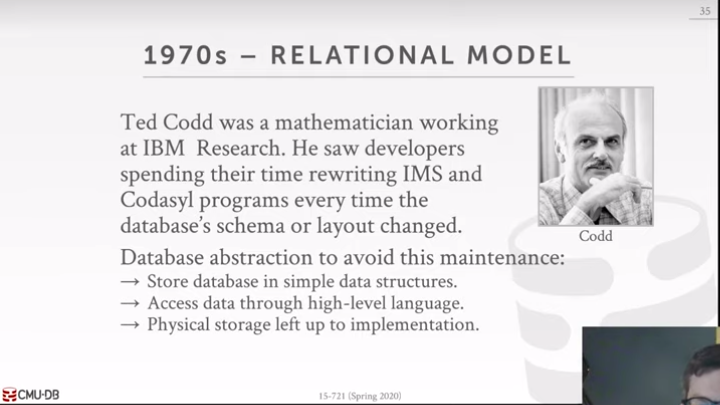
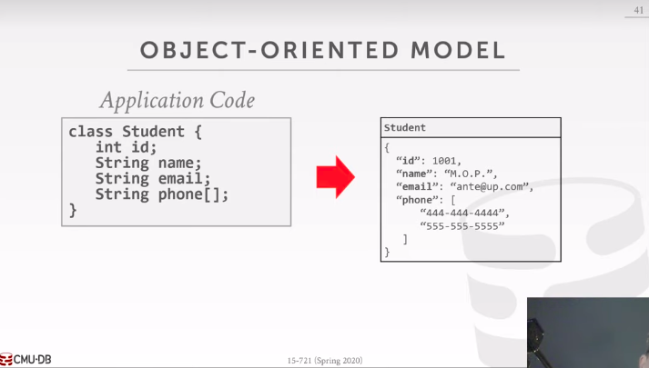
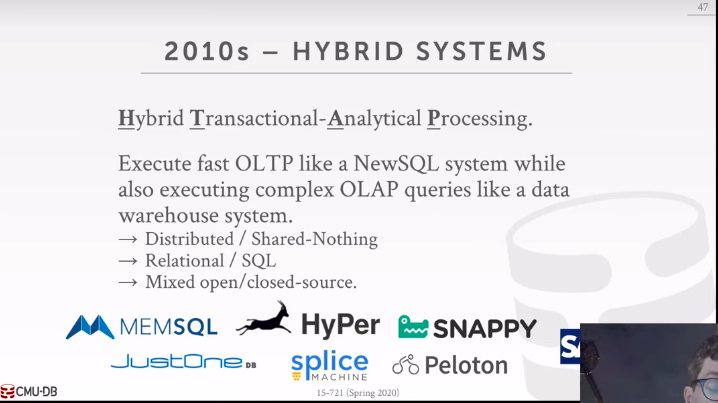

[TOC]

# 13 Query Execution & Processing

# Why you should take this course

# I History of Databases

## 1.1 Network Data Model

!Complex Queries

!Easily Corrupted (一份文件损坏，整个系统崩溃，那时候的人也不喜欢备份)

## 1.2 IBM IMS （Hierarchical Data Model）

- Duplicated Data (Different supplier provides same Battery needs different data instances over and over again. `That means if the battery name changes, I need to go to find all the battery instances and change their name at the same time`)
- No independence (Supplier's parts point to PART)

## 1.3 Relational Model

**We will join these tables before we find the tuple we need.**

## 1.4 Object-oriented Model

- Complex Queries （进行复杂的查询并不方便）

- No Standard API （没有像SQL那样的标准）

## 1.5 Internet Boom

## 1.6 The future

CMU教授个人对未来的设想

