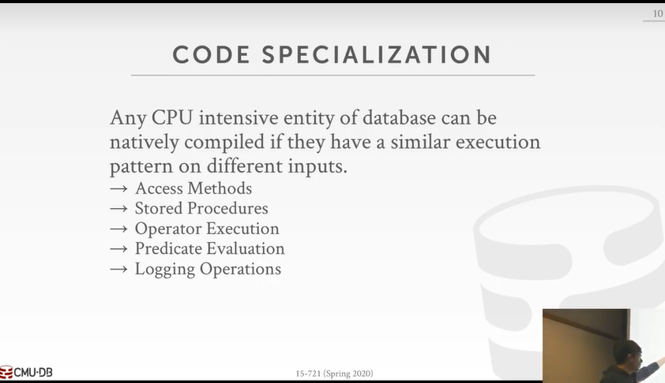

# 14 Query Compilation & Processing

# Agenda

# Preliminary

## 1 Definition of transiplation

Q:

A:

## 2 Hekaton Remark

### 2.1 Example Database

### 2.2 Predicate Interpretation

Database will interpret `B.val = ? + 1` as a tree execution as it's shown as below:

- if this kind of query needs to be executed for 10B times, there will be 4*10B times jumps, which is slow.

# I Code Specialization

- Access Methods 很少有系统做
- Predicate Evaluation is quite common

## 1.1 Benefits

## 1.2 Architecture Overview

Today we only care much about the Physical Plan generated by the Optimizer, other procedures will affect the system performance though.

**Compiler will receive the Plan and compile it into machine code**

# II Code Generation

## 1 Transpilation

- Write code that converts a relational query plan into imperative language **source code** and then run it through a conventional compiler to generate native code.

Please refer to the <a href="#Preliminary">Preliminary</a> for its explanation from StackOverflow

### 1.1 HIQUE

## 2 JIT Compilation

- Generate an **intermediate representation (IR)** of the query that the DBMS then compiles into native code.

Translate you high-level code into **IR** like JVM bytecode

